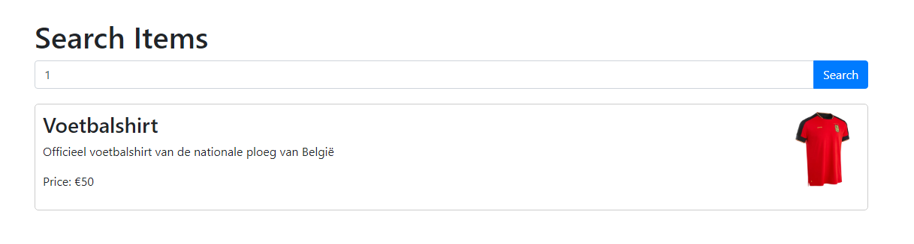
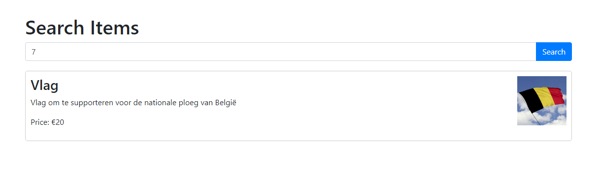
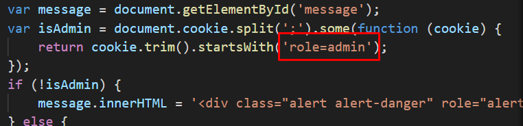
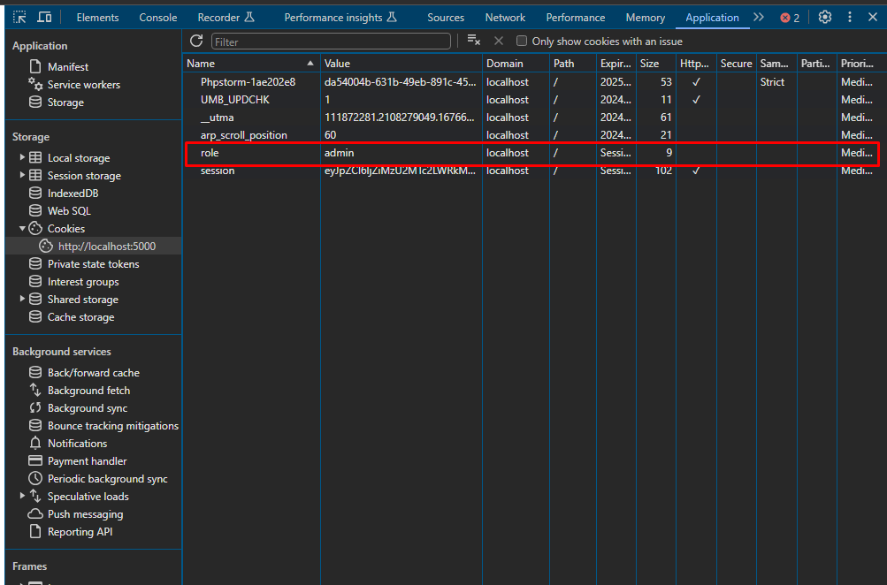
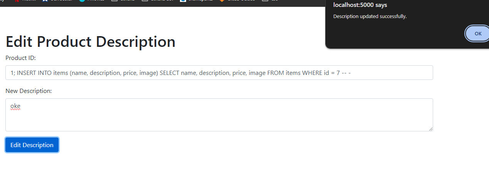
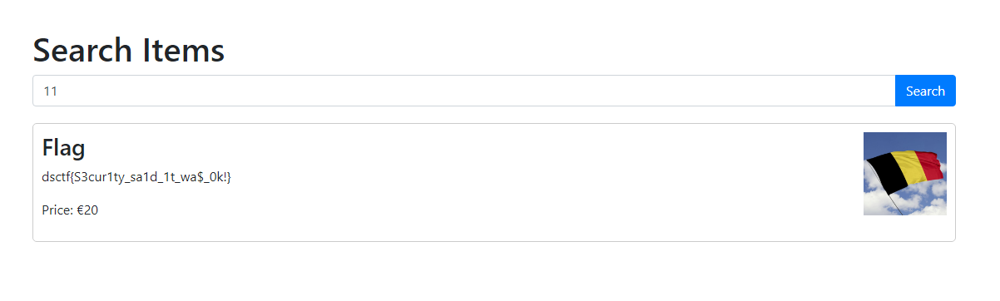

# Belgium Football Emporium

## Category
Web

## Estimated Difficulty
Hard (3?)

## Scenario
De belgische voetbalbond heeft een bedrijf ingeschakeld om een demo te maken voor een webshop waar mensen merchendise kunnen kopen naar aanleiding van het EK. Een van de vereisen is dat je als beheerder de mogelijkheid moet hebben om de beschrijving van producten aan te kunnen passen. Het tweede is dat niet alle data zomaar zichtbaar mag zijn in de catalogus

## Write-up
Wanneer je de website bekijkt is het mogelijk om op basis van id's producten op te vragen. Dit returnt data van het product uit de database

Op id 7 staat er een product 'vlag' mischien is dit een tip naar de locatie van de vlag?

Als we de admin pagina bekijken hebben we geen toegang. Als we in de source code kijken wanneer iemand admin is kunnen we zien dat dit gebeurt met een cookie?

Cookies runnen lokaal in de browser dus die kunnen we setten right? Open chrome => F12 => Application => cookies => website selecteren => double click onder de andere cookies => cookie toevoegen (role=admin)

Nu hebben we toegang tot de admin pagina! Als we de source code bekijken bij het updaten van de beschrijving zou het mogelijk moeten zijn om sql injectie uit te voeren. Echter returnt deze functie niets...
Om toch de data uit de database te krijgen van de record met id 7 zullen we dus een oplossing moeten vinden. Door gebruik te maken van sql injectie kunnen we de record met id 7 copieren en opnieuw toevoegen aan de database.

sql injection command
- 1; INSERT INTO items (name, description, price, image) SELECT name, description, price, image FROM items WHERE id = 7 -- -

Als we nu terug gaan naar de homepage en de laatste record opvragen (11) dan krijgen we de juiste flag die uit de database komt!

